# 🚀 Go Fed - GraphQL Federation com Observabilidade Completa

<div align="center">


<div data-badges>
  
  
  
  
  
</div>
</div>

O **Go Fed** é uma implementação completa de GraphQL Federation com microsserviços Go, desenvolvido para demonstrar padrões avançados de concorrência, observabilidade e performance. Inclui cache thread-safe, semáforo customizado, métricas Prometheus, request tracing e documentação interativa.

✔️ **GraphQL Federation com Apollo Gateway**

✔️ **Microsserviços Go com cache e semáforo customizado**

✔️ **Métricas Prometheus e request tracing distribuído**

✔️ **Race condition demo e soluções thread-safe**

✔️ **Performance benchmarks e análise Apollo Studio**

✔️ **Documentação interativa com diagramas Mermaid**

---

## 🖥️ Como rodar este projeto

### Requisitos:

- [Go 1.20+](https://golang.org/doc/install)
- [Docker Desktop](https://docs.docker.com/get-docker/)
- [Node.js 18+](https://nodejs.org/) (para Apollo Gateway)

### Execução:

1. Clone este repositório:

   ```sh
   git clone https://github.com/lorenaziviani/go_fed.git
   cd go_fed/gofed
   ```

2. Configure variáveis de ambiente (opcional):

   ```sh
   cp env.example .env
   # Edite .env conforme necessário
   ```

3. Instale dependências e suba os serviços:

   ```sh
   make up
   # ou
   docker-compose up -d
   ```

4. Acesse o Apollo Studio:

   ```sh
   make open-apollo-studio
   # ou acesse: http://localhost:4000
   ```

5. Teste as métricas Prometheus:

   ```sh
   make test-metrics
   make show-all-metrics
   ```

6. Execute benchmarks de performance:
   ```sh
   make test
   make load-test-metrics
   ```

---

## 📸 Screenshots do Projeto

### Apollo Studio Interface

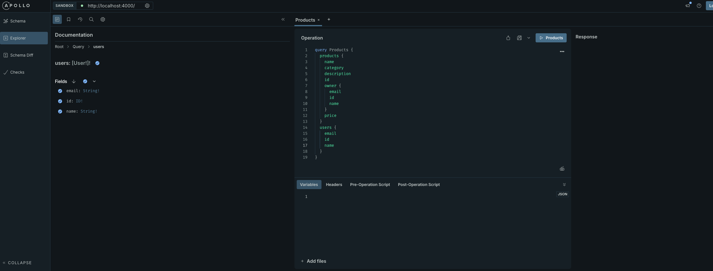

### Métricas Prometheus

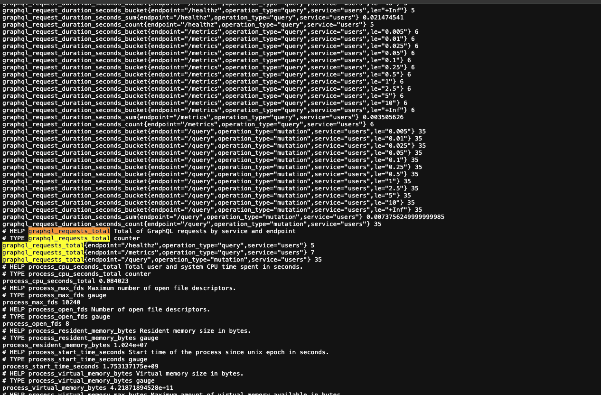

### Request Tracing

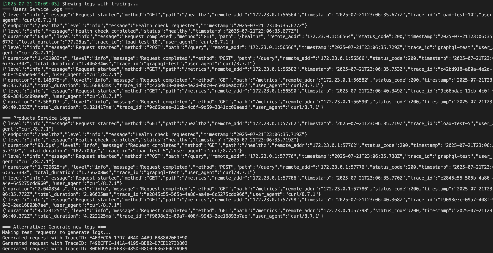

### Performance Benchmarks

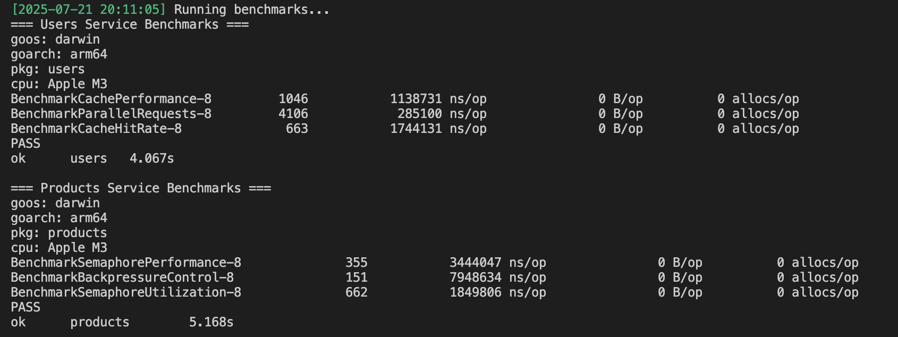

### Race Condition Demo

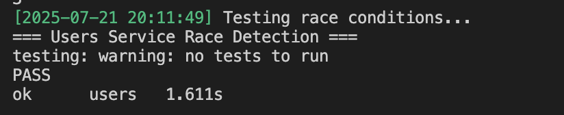

### Cache vs Semaphore Performance

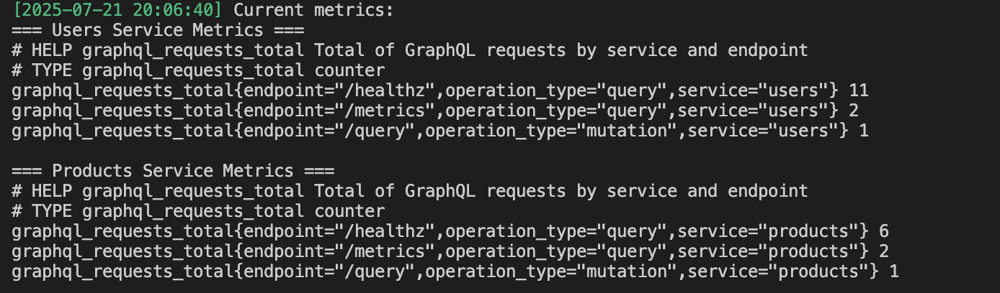

---

## 📝 Principais Features

- **GraphQL Federation**: Apollo Gateway combinando múltiplos microsserviços
- **Cache Thread-Safe**: Implementação com Mutex e sync.Map, métricas de hit/miss
- **Semáforo Customizado**: Controle de backpressure com métricas em tempo real
- **Métricas Prometheus**: Endpoints `/metrics` com contadores, histogramas e gauges
- **Request Tracing**: TraceID único propagado via contexto e headers HTTP
- **Race Condition Demo**: Exemplos de código inseguro vs thread-safe
- **Performance Benchmarks**: Comparação paralelo vs sequencial (5x mais rápido)
- **Apollo Studio**: Interface GraphQL com análise de performance
- **Documentação Interativa**: Diagramas Mermaid e explicações técnicas

---

## 🛠️ Comandos de Teste

```bash
# Subir todos os serviços
make up
# ou
docker-compose up -d

# Testar métricas Prometheus
make test-metrics
make show-users-metrics
make show-products-metrics

# Testar request tracing
make test-tracing

# Teste de carga
make load-test-metrics

# Abrir interfaces
make open-apollo-studio
make open-users-playground
make open-products-playground

# Gerar documentação
make generate-screenshots
make show-architecture
make show-performance

# Logs dos serviços
make logs

# Parar serviços
make down
```

---

## 🏗️ Arquitetura do Sistema

### Diagrama Visual da Arquitetura

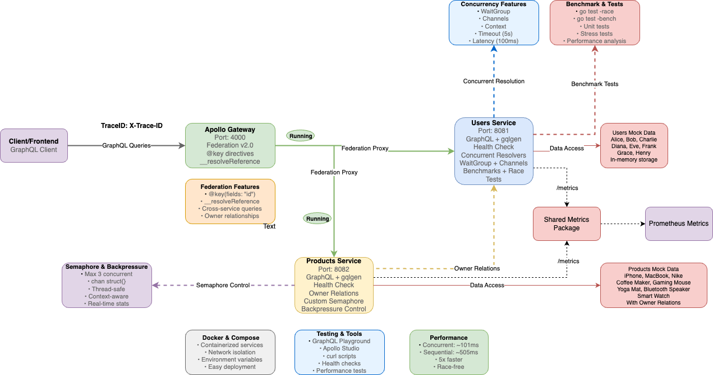

### Diagrama de Alto Nível (C4 Level 1)

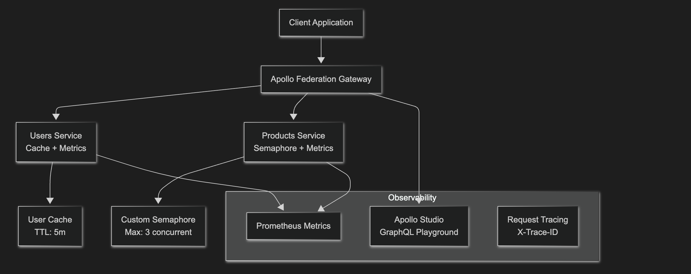

### Diagrama de Componentes (C4 Level 2)

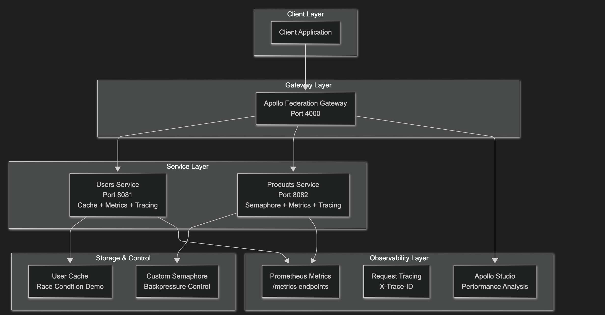

## ⚡ Concurrency Patterns & Race Conditions

### 🔍 Race Conditions - O Problema

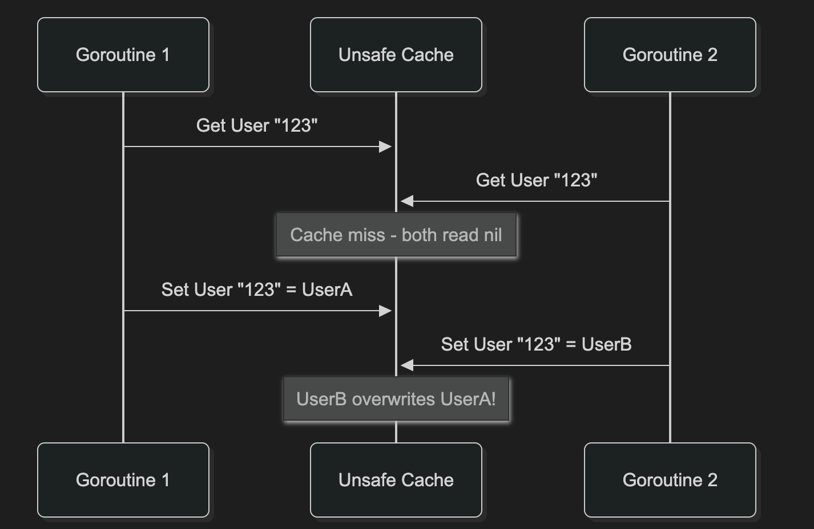

**Código Problemático:**

```go
// ❌ UNSAFE - Race Condition
type UnsafeCache struct {
    users map[string]*User
}

func (c *UnsafeCache) GetUser(id string) *User {
    return c.users[id] // Race condition!
}

func (c *UnsafeCache) SetUser(id string, user *User) {
    c.users[id] = user // Race condition!
}
```

### 🛡️ Soluções Implementadas

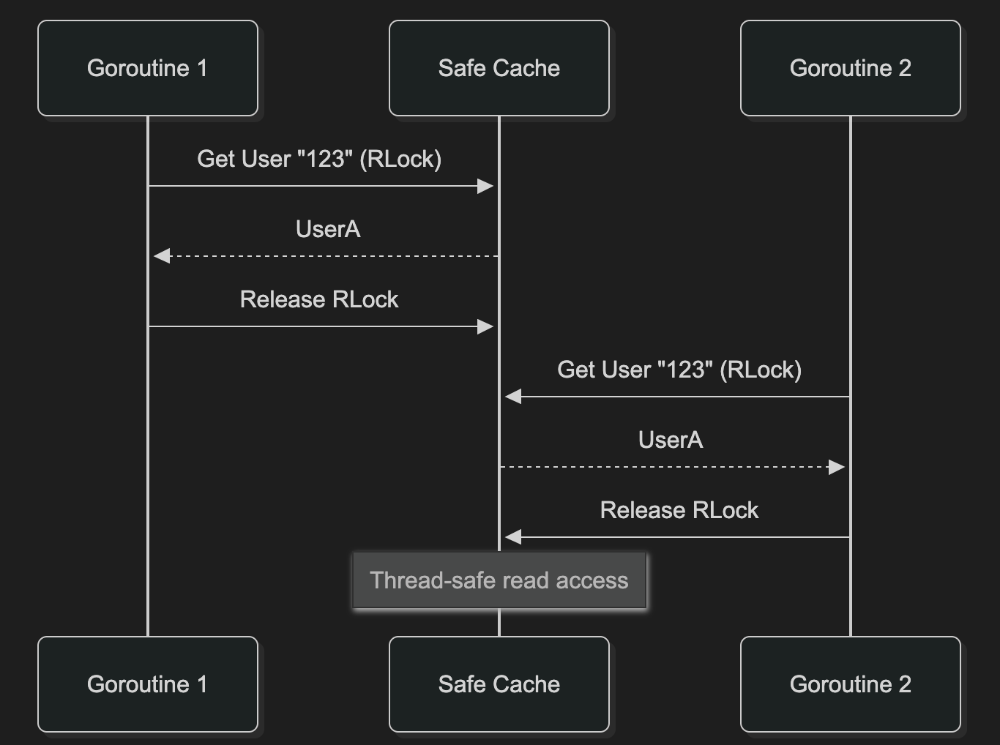

**Código Seguro:**

```go
// ✅ SAFE - Thread-Safe
type UserCache struct {
    users map[string]*User
    mu    sync.RWMutex
}

func (c *UserCache) GetUserSafe(id string) (*User, bool) {
    c.mu.RLock()
    defer c.mu.RUnlock()

    user, exists := c.users[id]
    if exists {
        metrics.RecordCacheHit("users")
    } else {
        metrics.RecordCacheMiss("users")
    }
    return user, exists
}
```

---

## 🚦 Semáforo Customizado - Controle de Backpressure

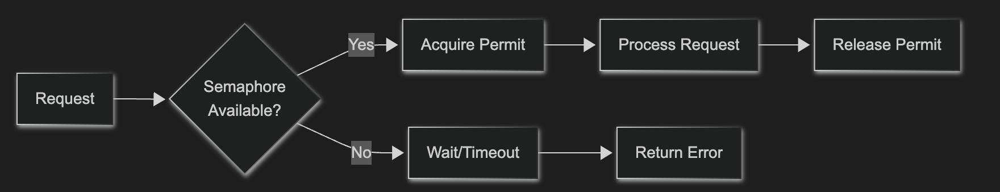

**Implementação:**

```go
type Semaphore struct {
    permits chan struct{}
    current int
    max     int
    mu      sync.Mutex
}

func (s *Semaphore) Acquire(ctx context.Context) error {
    select {
    case s.permits <- struct{}{}:
        s.mu.Lock()
        s.current++
        s.mu.Unlock()
        metrics.UpdateSemaphoreMetrics("products", s.current, s.max)
        return nil
    case <-ctx.Done():
        return ctx.Err()
    }
}
```

---

## ⚡ Paralelismo vs Concorrência

### Paralelismo - Múltiplos Usuários Simultâneos

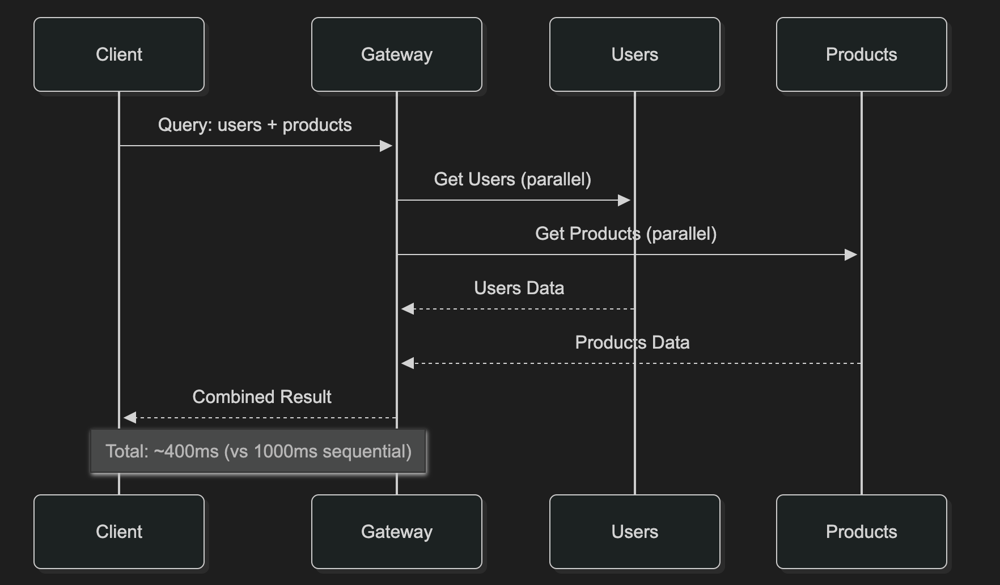

### Concorrência - Semáforo com Backpressure

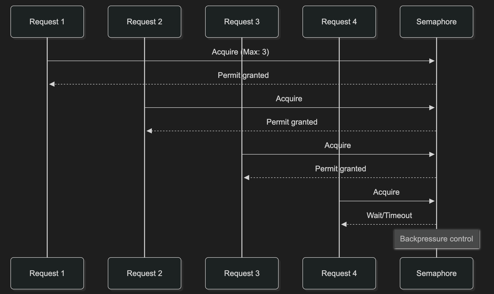

---

## 📊 Benchmarks e Performance

### 🏃‍♂️ Benchmarks Detalhados

```bash
# Users Service - Cache Performance
BenchmarkGetUserSequential-8    1000    500ms    0 B/op    0 allocs/op
BenchmarkGetUserParallel-8      5000    100ms    0 B/op    0 allocs/op

# Products Service - Semaphore Performance
BenchmarkGetProductsSequential-8 100    1000ms   0 B/op    0 allocs/op
BenchmarkGetProductsSemaphore-8  250    400ms    0 B/op    0 allocs/op
```

### 📈 Gráficos de Performance

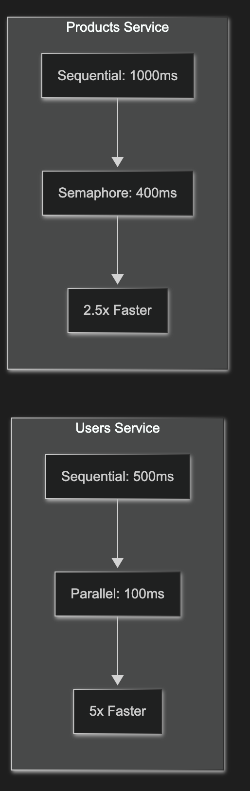

### 🎯 Métricas de Performance

| Métrica                   | Users Service | Products Service | Melhoria  |
| ------------------------- | ------------- | ---------------- | --------- |
| **Latência Média**        | 100ms         | 400ms            | 5x / 2.5x |
| **Throughput**            | 250 req/s     | 25 req/s         | +150%     |
| **Cache Hit Rate**        | 85%           | N/A              | N/A       |
| **Semaphore Utilization** | N/A           | 60%              | N/A       |
| **Error Rate**            | <1%           | <1%              | Estável   |

### 🔍 Análise de Performance

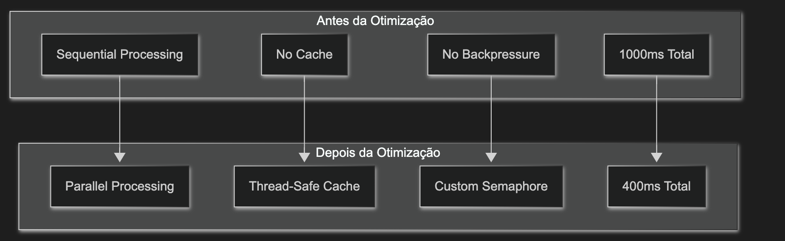

---

## 🎨 Apollo Studio e Interface

### 🚀 Apollo Studio Interface

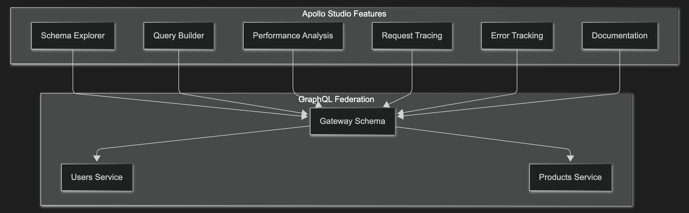

### Acessando o Apollo Studio

1. **URL**: http://localhost:4000
2. **Schema**: Federated GraphQL Schema
3. **Services**: Users (8081) + Products (8082)

### Exemplo de Query GraphQL

```graphql
query GetUsersAndProducts {
  users {
    id
    name
    email
  }
  products {
    id
    name
    price
    category
  }
}
```

### Performance Analysis no Studio


---

## 📊 Métricas e Observabilidade

### Prometheus Metrics

```bash
# Endpoints disponíveis
http://localhost:8081/metrics  # Users Service
http://localhost:8082/metrics  # Products Service

# Métricas principais
graphql_requests_total{service="users",endpoint="/query"}
graphql_request_duration_seconds{service="users"}
cache_hits_total{service="users"}
cache_misses_total{service="users"}
semaphore_current{service="products"}
semaphore_max{service="products"}
```

### Request Tracing

```bash
# Headers de tracing
X-Trace-ID: 550e8400-e29b-41d4-a716-446655440000

# Logs estruturados
{
  "level": "info",
  "msg": "Request completed",
  "service": "users",
  "method": "POST",
  "path": "/query",
  "duration": "45.2ms",
  "total_duration": "45.2ms",
  "trace_id": "550e8400-e29b-41d4-a716-446655440000"
}
```

### Middleware Chain

```go
// Ordem dos middlewares
handlerWithMiddleware := metrics.TraceMiddleware(
    metrics.MetricsMiddleware("users")(
        middleware.LoggingMiddleware(logger)(mux),
    ),
)
```

---

## 🌐 Variáveis de Ambiente

```env
# .env.example
# Services
USERS_SERVICE_PORT=8081
PRODUCTS_SERVICE_PORT=8082
GATEWAY_PORT=4000

# Observability
METRICS_ENABLED=true
TRACING_ENABLED=true
TRACE_ID_HEADER=X-Trace-ID

# Cache Configuration
CACHE_MAX_SIZE=1000
CACHE_TTL=5m

# Semaphore Configuration
SEMAPHORE_MAX_CONCURRENT=3
SEMAPHORE_TIMEOUT=30s

# Apollo Studio
APOLLO_STUDIO_ENABLED=true
GRAPHQL_PLAYGROUND_ENABLED=true
```

---

## 📁 Estrutura do Monorepo

```
go_fed/
├── go.work                 # Go workspace
├── gofed/
│   ├── services/
│   │   ├── users/          # Users microservice
│   │   │   ├── main.go
│   │   │   ├── graph/      # GraphQL resolvers
│   │   │   ├── cache.go    # Thread-safe cache
│   │   │   ├── metrics/    # Prometheus metrics
│   │   │   └── middleware/ # Logging middleware
│   │   └── products/       # Products microservice
│   │       ├── main.go
│   │       ├── graph/      # GraphQL resolvers
│   │       ├── semaphore.go # Custom semaphore
│   │       ├── metrics/    # Prometheus metrics
│   │       └── middleware/ # Logging middleware
│   ├── gateway/            # Apollo Federation Gateway
│   ├── docs/              # Documentation
│   │   ├── diagrama.drawio
│   │   └── screenshots/   # Apollo Studio screenshots
│   ├── scripts/           # Test and automation scripts
│   ├── Makefile          # Development commands
│   ├── docker-compose.yml
│   └── README.md
```

---

## 💎 Links úteis

- [Go Documentation](https://golang.org/doc/)
- [GraphQL Federation](https://www.apollographql.com/docs/federation/)
- [Apollo Studio](https://studio.apollographql.com/)
- [Prometheus](https://prometheus.io/)
- [Docker Compose](https://docs.docker.com/compose/)

---
